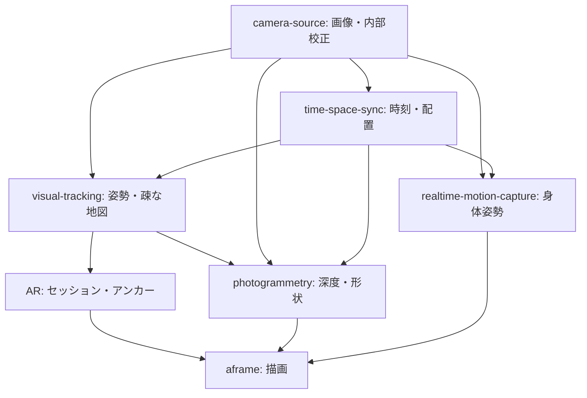

# TurboWarp-Time-Space-Sync

[日本語](README.ja.md)

Optical time correspondence and camera placement calibration for TurboWarp. This repository is based on `turbowarp-extension-template` v0.4.0.

## What it does

Shows a time coded pattern on screen and decodes it back out of a camera, so a recorded frame can be placed against the moment the pattern was drawn. Placement against a measured physical reference is not implemented yet.

Everything is behind startup-fixed feature flags in `config/feature-flags.ts`, **off by default**: an extension loaded without them publishes no blocks. Set them before the project starts:

```js
globalThis.__TWTSS_FEATURE_FLAGS__ = {opticalTimeSyncV1: true};
```

### What a measurement does and does not say

An optical reading constrains the sum of three unknowns: the offset between the two clocks, the camera's capture-to-timestamp delay, and the display's draw-to-photons delay. It cannot separate them. Results are therefore reported as `displayToTimestampDelayUs` with the folded-in components listed, never as a clock offset, and a time correction never implies that two cameras were exposed at the same instant.

A pattern code stays on screen for one display refresh, so the effective resolution is the refresh interval; the one millisecond step is only the quantisation of the displayed value. A reading also only decodes when the whole camera exposure falls inside one displayed code, which makes the decode rate roughly `1 - exposure / refresh`. A low rate usually means the exposure is too long rather than the panel too dim, and the decoder says which.

If the camera's frame interval is a whole multiple of four pattern steps, the two lowest cells never change state, calibration learns no contrast for them and fails. Choose a calibration window whose frame interval is not such a multiple.

### Photosensitivity

The pattern covers a large area and reverses many cells every refresh. Showing it requires an explicit acknowledgement from the operator, the default panel covers 35% of the shorter screen edge, and Escape removes it at any time. The guidance this is measured against depends on the viewer's distance from the screen, which nothing here knows, so these are mitigations and not a claim of compliance.

## Planned implementation

See [the Japanese implementation proposal](README.ja.md) for responsibilities, dependencies, acceptance criteria and rollback. The proposal is also copied below so this entrypoint records the intended work.

### 目的

時刻対応とカメラ配置の校正を提供するTurboWarp拡張として開発する。

### 実装予定

- 光学時刻パターンの生成・読取りと、共通時刻への変換（差・ドリフト・不確かさ）。
- スクリーン等の既知の実寸基準からカメラ配置を推定し、固定rigの相対姿勢を管理する。
- 同一PCの複数カメラと、WebRTCで接続された複数PCの観測を同じAPIで扱う。

### パッケージ間の関係

- camera-source: 校正済み画像・撮影時刻。内部校正は本パッケージに重複実装しない。
- time-space-sync-app: QR搬送ペアリング、WebRTC接続、表示・実寸入力・観測収集の操作。既存realtime-motion-capture-appから共通処理を抽出する。
- AR / visual-tracking / photogrammetry / realtime-motion-capture: 同期・配置校正の利用側。

### 設計上の条件

時計差と表示・撮影遅延を区別する。時刻補正は同時露光を保証しない。投影歪み、測定寸法の精度、変換方向・軸・単位を記録する。

### 段階導入・受け入れ基準

1. 既存実装の所在・APIと校正形式を確認し、関連GitHub Issueでスコープを確定する。
2. 互換性を保った最小経路を実装する。新経路のフィーチャーフラグは既定OFFとし、導入時に設定場所を定義する。
3. 静止基準を撮影した2台の配置を独立した寸法測定で検証し、共通時刻の残差・再投影誤差を報告できる。
4. 単体検証に加えて実カメラによる統合検証を記録する。

### ロールバック

抽出元の旧経路を移行中は保持し、フラグOFFで切り戻す。保存済み校正形式の互換読取りを保持する。初期雛形にはアルゴリズムもフラグもまだ存在しない。

### タスク管理

この文書はローカルの提案草案。実装着手前に本リポジトリのGitHub Issuesへ依存・DoD・チェックリスト・start/done/blockedログを記録する。Issueの作成・投稿は今回の初期配置には含まない。

## Planned architecture



Arrows indicate provider → consumer. This is a proposal; these integrations are not implemented in the scaffold.

## Requirements and safety

Node.js >=22.18.0 and pnpm 11.11.0. The extension runs unsandboxed because it leases a camera through `turbowarp-camera-source` and draws a full screen overlay. It has no runtime dependencies and does not bundle OpenCV. Published packages and hosted documentation are not available yet.

## Development

```bash
corepack enable
pnpm install --frozen-lockfile
pnpm run build
pnpm run typecheck
pnpm run lint
pnpm run test
pnpm run repo:check
```

Package identity: `@kubohiroya/turbowarp-time-space-sync@0.1.0` (local scaffold, not a published installation).
Bundle: `dist/time-space-sync.js`. Contract: `dist/extension-manifest.json`.

`pnpm run check` additionally checks generated files against Git. Run it after the initial files have been committed. No initial commit or remote publication is performed by scaffolding.

## Block reference

<!-- BEGIN GENERATED BLOCKS -->

### `acknowledge that the time pattern flashes`

Records that the operator was warned the full screen pattern flashes. The pattern will not be shown until this runs, and the acknowledgement lasts until the project stops.

| Property | Value |
|---|---|
| Type | Command |
| Opcode | `acknowledgePatternFlashing` |

### `show time pattern`

Covers the screen with the time coded pattern. The panel stays blank until the display refresh interval has been measured, so nothing decodable is shown from a guess.

| Property | Value |
|---|---|
| Type | Command |
| Opcode | `showTimePattern` |

### `hide time pattern`

Removes the time pattern overlay. Escape also removes it, and so does the page ceasing to be shown.

| Property | Value |
|---|---|
| Type | Command |
| Opcode | `hideTimePattern` |

### `time pattern shown?`

Reports whether the time pattern overlay is on screen.

| Property | Value |
|---|---|
| Type | Boolean |
| Opcode | `timePatternShown` |

### `time pattern stable?`

Reports whether the display refresh interval has been measured. While false the panel is blank and no camera can read a time from it.

| Property | Value |
|---|---|
| Type | Boolean |
| Opcode | `timePatternStable` |

### `time pattern refresh us`

Returns the measured display refresh interval in microseconds, or 0 before it has been measured.

| Property | Value |
|---|---|
| Type | Reporter |
| Opcode | `timePatternRefreshUs` |

### `time pattern wrap us`

Returns the period after which the encoded display time repeats, in microseconds.

| Property | Value |
|---|---|
| Type | Reporter |
| Opcode | `timePatternWrapUs` |

### `time pattern profile id`

Returns the identifier of the pattern profile in use. The decoder must be given the same profile or no reading will ever decode.

| Property | Value |
|---|---|
| Type | Reporter |
| Opcode | `timePatternProfileId` |

### `start optical time decoder for camera [CAMERA_ID] reference [REFERENCE_ID] calibrating [SECONDS] seconds at [REFRESH_US] us refresh`

Leases the camera, locates the pattern, learns each cell light and dark level, and refuses when readings do not decode often enough. The display refresh interval must be supplied because it sets how long each code stays on screen.

| Property | Value |
|---|---|
| Type | Command |
| Opcode | `startOpticalTimeDecoder` |
| `CAMERA_ID` | String, default: `default` |
| `REFERENCE_ID` | String, default: `screen` |
| `SECONDS` | Number, default: `8` |
| `REFRESH_US` | Number, default: `16667` |

### `calibrate optical time decoder for [SECONDS] seconds`

Runs calibration again on a running decoder, for example after the camera or the display moved.

| Property | Value |
|---|---|
| Type | Command |
| Opcode | `calibrateOpticalTimeDecoder` |
| `SECONDS` | Number, default: `8` |

### `stop optical time decoder`

Stops decoding and releases the camera lease.

| Property | Value |
|---|---|
| Type | Command |
| Opcode | `stopOpticalTimeDecoder` |

### `optical time decoder state`

Returns idle, acquiring-camera, calibrating, ready, or error.

| Property | Value |
|---|---|
| Type | Reporter |
| Opcode | `opticalTimeDecoderState` |

### `optical time decoder error`

Returns the last decoder error code, or an empty string when there is none.

| Property | Value |
|---|---|
| Type | Reporter |
| Opcode | `opticalTimeDecoderError` |

### `optical time decode rate`

Returns the share of recent camera frames the decoder could read, between 0 and 1. It is governed by the camera exposure: a reading only decodes when the whole exposure falls inside one displayed code.

| Property | Value |
|---|---|
| Type | Reporter |
| Opcode | `opticalTimeDecodeRate` |

### `optical time decode margin`

Returns how much room the weakest cell of the last reading had to spare, in luminance units. A panel drifting out of readability shows here as a falling margin before it starts failing.

| Property | Value |
|---|---|
| Type | Reporter |
| Opcode | `opticalTimeDecodeMargin` |

### `optical time observation available?`

Reports whether a decoded observation is waiting to be taken.

| Property | Value |
|---|---|
| Type | Boolean |
| Opcode | `opticalTimeObservationAvailable` |

### `optical time observation count`

Returns how many observations are currently held. Observations are kept for a fixed stretch of time rather than a fixed count, so the window does not change length with the decode rate.

| Property | Value |
|---|---|
| Type | Reporter |
| Opcode | `opticalTimeObservationCount` |

### `optical time dropped count`

Returns how many observations were discarded for leaving the retention window or exceeding the memory cap.

| Property | Value |
|---|---|
| Type | Reporter |
| Opcode | `opticalTimeDroppedCount` |

### `optical time rejected count`

Returns how many readings decoded but could not follow the previous one in real time. A frozen panel and a reading that slipped past the check bits both land here.

| Property | Value |
|---|---|
| Type | Reporter |
| Opcode | `opticalTimeRejectedCount` |

### `take next optical time observation`

Removes the oldest observation from the queue and exposes it to the observation reporter.

| Property | Value |
|---|---|
| Type | Command |
| Opcode | `takeOpticalTimeObservation` |

### `latest optical time observation JSON`

Returns the taken observation as twtss/optical-time-observation version 1 JSON, or an empty string before one is taken.

| Property | Value |
|---|---|
| Type | Reporter |
| Opcode | `latestOpticalTimeObservationJson` |

### `optical time minimum calibration seconds`

Returns the shortest calibration window in which every pattern cell is guaranteed to change state at least once.

| Property | Value |
|---|---|
| Type | Reporter |
| Opcode | `opticalTimeMinimumCalibrationSeconds` |

### `estimate time correspondence`

Intersects the observations collected so far into one delay. A reading bounds the delay rather than measuring it, so the result is the set of delays every reading allows; when a strict majority cannot agree on any, nothing is published.

| Property | Value |
|---|---|
| Type | Command |
| Opcode | `estimateTimeCorrespondence` |

### `time correspondence JSON`

Returns the last estimate as twtss/time-correspondence version 1 JSON, or an empty string when none has been made.

| Property | Value |
|---|---|
| Type | Reporter |
| Opcode | `timeCorrespondenceJson` |

### `time correspondence error`

Returns why the last estimate could not be made, or an empty string when it succeeded.

| Property | Value |
|---|---|
| Type | Reporter |
| Opcode | `timeCorrespondenceError` |

### `display to timestamp delay us`

Returns how much later a frame is stamped than the pattern it shows was drawn, in microseconds. This is not a clock offset: an optical reading constrains only the sum of the clock offset and the two pipeline delays, and the components folded in are listed in the JSON.

| Property | Value |
|---|---|
| Type | Reporter |
| Opcode | `displayToTimestampDelayUs` |

### `time correspondence uncertainty us`

Returns half the width of the delays the readings agree on. It shrinks as readings accumulate and never reaches zero, because one refresh of the display is never resolved.

| Property | Value |
|---|---|
| Type | Reporter |
| Opcode | `timeCorrespondenceUncertaintyUs` |

### `time correspondence current?`

Reports whether the last estimate still describes the present. Every estimate expires: one measured before the camera refocused or the clock was re-estimated is not a smaller measurement but a measurement of something else.

| Property | Value |
|---|---|
| Type | Boolean |
| Opcode | `timeCorrespondenceCurrent` |

<!-- END GENERATED BLOCKS -->

## License

MPL-2.0. See [LICENSE](LICENSE).
