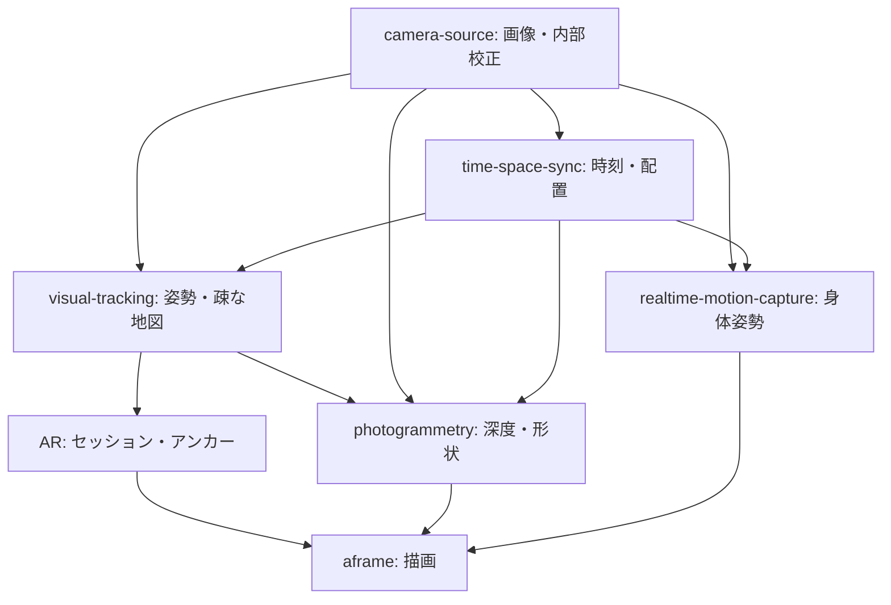

# TurboWarp-Time-Space-Sync

[日本語](README.ja.md)

Initial TurboWarp extension scaffold for time-space-sync. This repository is based on `turbowarp-extension-template` v0.4.0. The proposed runtime algorithms are not implemented yet.

## What it does

Currently provides only the template's `hello [NAME]` smoke-test block, a Vite bundle, an API manifest, tests and CI. It does not perform synchronization, tracking, or reconstruction.

## Planned implementation

See [the Japanese implementation proposal](README.ja.md) for responsibilities, dependencies, acceptance criteria and rollback. The proposal is also copied below so this entrypoint records the intended work.

### 目的

時刻対応とカメラ配置の校正を提供するTurboWarp拡張として開発する。

### 実装予定

- 光学時刻パターンの生成・読取りと、共通時刻への変換（差・ドリフト・不確かさ）。
- スクリーン等の既知の実寸基準からカメラ配置を推定し、固定rigの相対姿勢を管理する。
- 同一PCの複数カメラと、WebRTCで接続された複数PCの観測を同じAPIで扱う。

### パッケージ間の関係

- camera-source: 校正済み画像・撮影時刻。内部校正は本パッケージに重複実装しない。
- time-space-sync-app: QR搬送ペアリング、WebRTC接続、表示・実寸入力・観測収集の操作。既存realtime-motion-capture-appから共通処理を抽出する。
- AR / visual-tracking / photogrammetry / realtime-motion-capture: 同期・配置校正の利用側。

### 設計上の条件

時計差と表示・撮影遅延を区別する。時刻補正は同時露光を保証しない。投影歪み、測定寸法の精度、変換方向・軸・単位を記録する。

### 段階導入・受け入れ基準

1. 既存実装の所在・APIと校正形式を確認し、関連GitHub Issueでスコープを確定する。
2. 互換性を保った最小経路を実装する。新経路のフィーチャーフラグは既定OFFとし、導入時に設定場所を定義する。
3. 静止基準を撮影した2台の配置を独立した寸法測定で検証し、共通時刻の残差・再投影誤差を報告できる。
4. 単体検証に加えて実カメラによる統合検証を記録する。

### ロールバック

抽出元の旧経路を移行中は保持し、フラグOFFで切り戻す。保存済み校正形式の互換読取りを保持する。初期雛形にはアルゴリズムもフラグもまだ存在しない。

### タスク管理

この文書はローカルの提案草案。実装着手前に本リポジトリのGitHub Issuesへ依存・DoD・チェックリスト・start/done/blockedログを記録する。Issueの作成・投稿は今回の初期配置には含まない。

## Planned architecture



Arrows indicate provider → consumer. This is a proposal; these integrations are not implemented in the scaffold.

## Requirements and safety

Node.js >=22.18.0 and pnpm 11.11.0. The current sample runs sandboxed. Future camera/WebGPU integration requires an explicitly implemented unsandboxed runtime and capability checks. Published packages and hosted documentation are not available as part of this scaffold.

## Development

```bash
corepack enable
pnpm install --frozen-lockfile
pnpm run build
pnpm run typecheck
pnpm run lint
pnpm run test
pnpm run repo:check
```

Package identity: `@kubohiroya/turbowarp-time-space-sync@0.2.0` (local scaffold, not a published installation).
Bundle: `dist/time-space-sync.js`. Contract: `dist/extension-manifest.json`.

`pnpm run check` additionally checks generated files against Git. Run it after the initial files have been committed. No initial commit or remote publication is performed by scaffolding.

## Block reference

<!-- BEGIN GENERATED BLOCKS -->

### `hello [NAME]`

Returns a localized greeting for the supplied name.

| Property | Value |
|---|---|
| Type | Reporter |
| Opcode | `hello` |
| `NAME` | String, default: `world` |

<!-- END GENERATED BLOCKS -->

## License

MPL-2.0. See [LICENSE](LICENSE).
